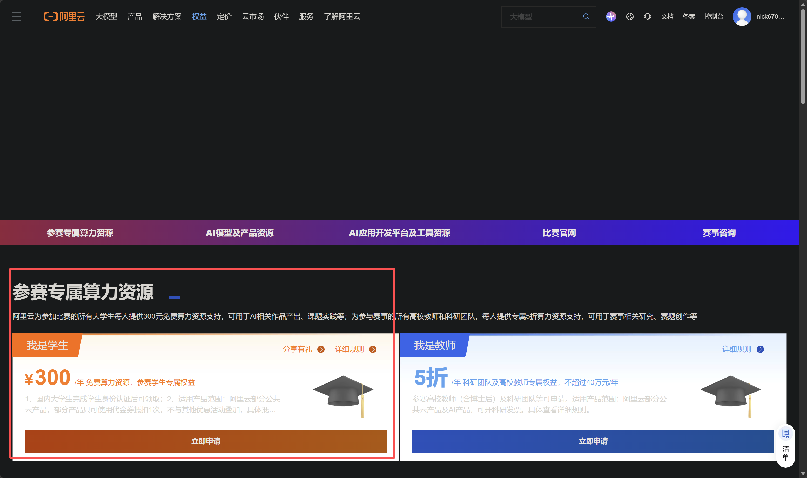
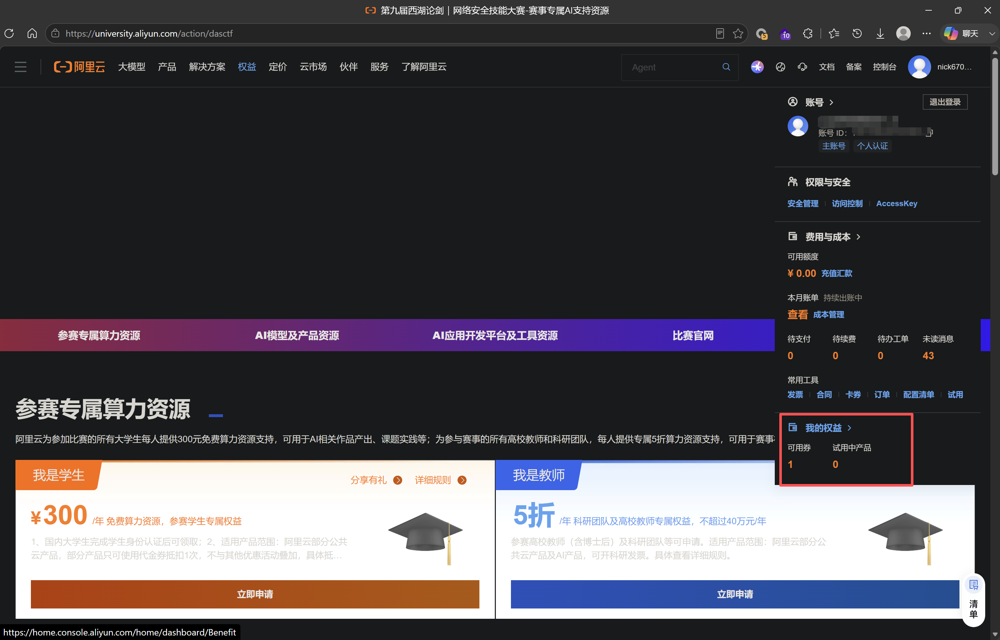
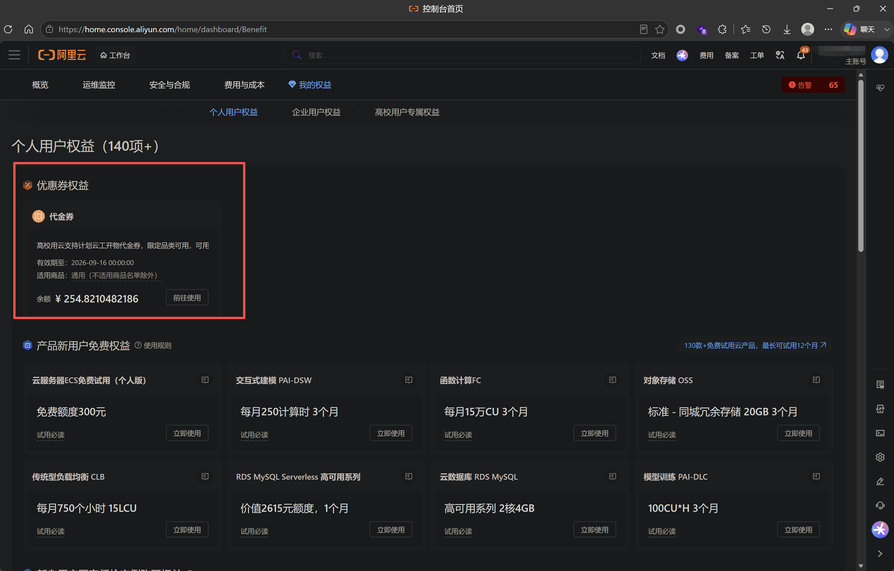
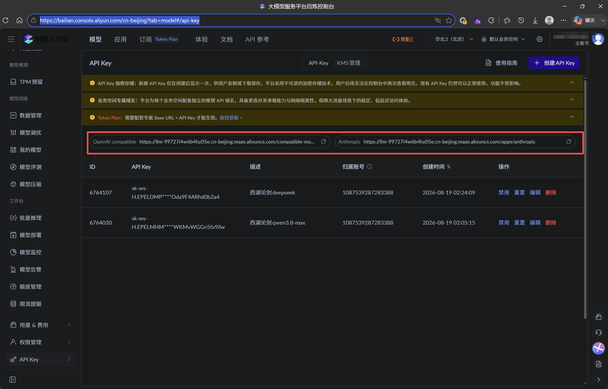
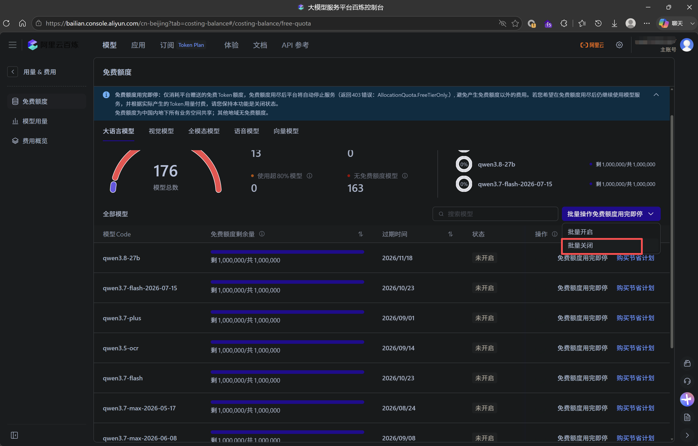

# 怎么领取阿里云提供价值300元的算力支持

　　访问[https://university.aliyun.com/action/dasctf](https://university.aliyun.com/action/dasctf)

　　学生认证后，点击领取

　　领取完后可以在 头像——>我的权益 查看

　　‍

　　接着到阿里云百炼创建api key

　　[大模型服务平台百炼控制台](https://bailian.console.aliyun.com/cn-beijing?tab=model#/api-key)

　　保存好api key和url

　　访问：[大模型服务平台百炼控制台](https://bailian.console.aliyun.com/cn-beijing?tab=costing-balance#/costing-balance/free-quota)

　　批量关闭免费额度用完即停

