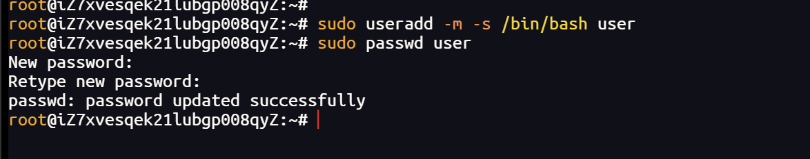
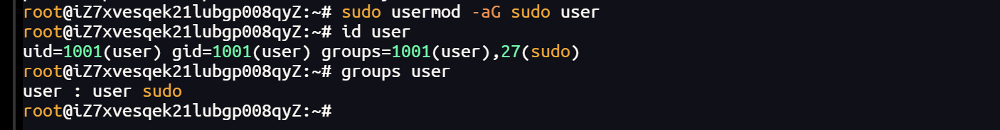

# 常用命令

创建用户并设置密码：

```
sudo useradd -m 用户名        # 创建用户并自动建 home 目录
sudo passwd 用户名            # 设置/修改密码
```

创建用户

```
sudo useradd -m -s /bin/bash 用户名   # 创建用户并建 home 目录
sudo passwd 用户名                    # 设置密码
```

修改用户

```
sudo usermod -aG sudo 用户名   # 加入 sudo 组（-a 表示追加，别漏）
sudo usermod -s /bin/bash 用户名   # 改登录 shell
sudo usermod -l 新名 旧名       # 改名
sudo usermod -m -d /新目录 用户名 # 改 home 目录并迁移文件
sudo passwd 用户名              # 改密码
```

删除用户

```
sudo userdel 用户名            # 删除用户，保留 home 目录
sudo userdel -r 用户名         # 删除用户连同 home 目录和邮件
```

常用检查

```
id 用户名          # 查看 UID、组、是否在 sudo 组
groups 用户名      # 查看所属组
```

------

# 例如创建user用户

```toml
sudo useradd -m -s /bin/bash user
```

设置密码

```toml
sudo passwd user
```



加入 sudo 组

```toml
sudo usermod -aG sudo user
```



------

要点：

- useradd 创建，usermod 修改，userdel 删除
- 改组成员务必用 -aG，否则会覆盖原有附属组
- 删除用户前先确认没有它拥有的重要文件，-r 会连文件一起删

加入 sudo 组：

```
sudo usermod -aG sudo 用户名   # Debian/Ubuntu
sudo usermod -aG wheel 用户名  # CentOS/RHEL
```

放进 sudo 组会怎么样：

- 可以用 sudo 执行管理员命令，比如 sudo apt install xxx
- 执行时通常仍需要输入自己的密码
- 能力上等同于管理员，可以修改系统、删除文件、安装软件，风险很高
- 所以只给可信用户加 sudo，用完也可以移除：sudo gpasswd -d 用户名 sudo

两个提醒：

1. 一定要用 -aG，只写 -G 会覆盖用户原有附属组，可能出问题
2. 如果系统有 adduser 命令，也可以直接 sudo adduser 用户名，它会交互式引导创建用户并设密码，更省事